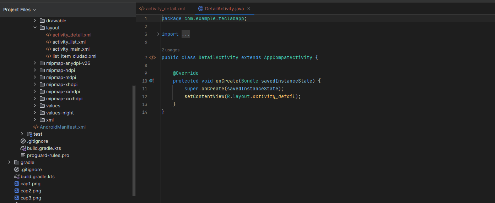
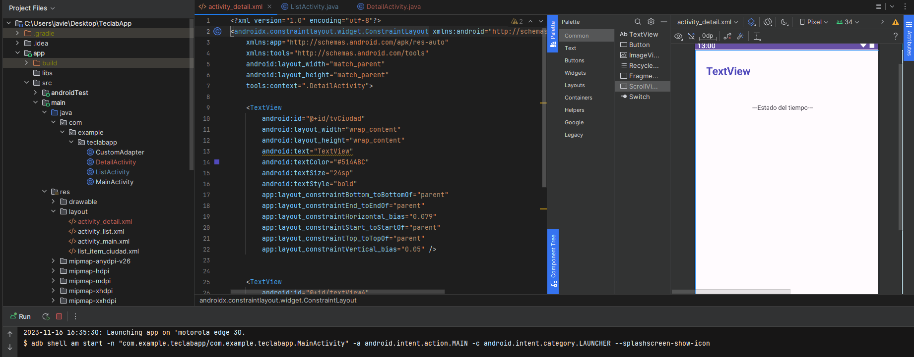
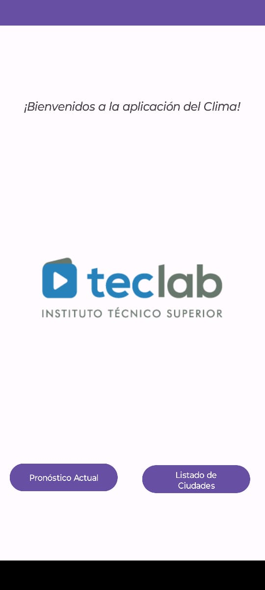
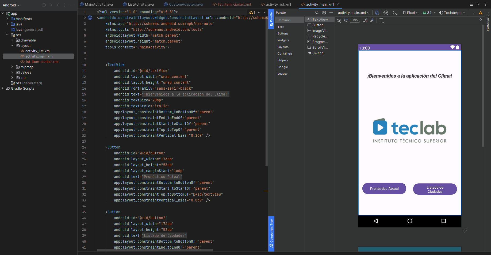
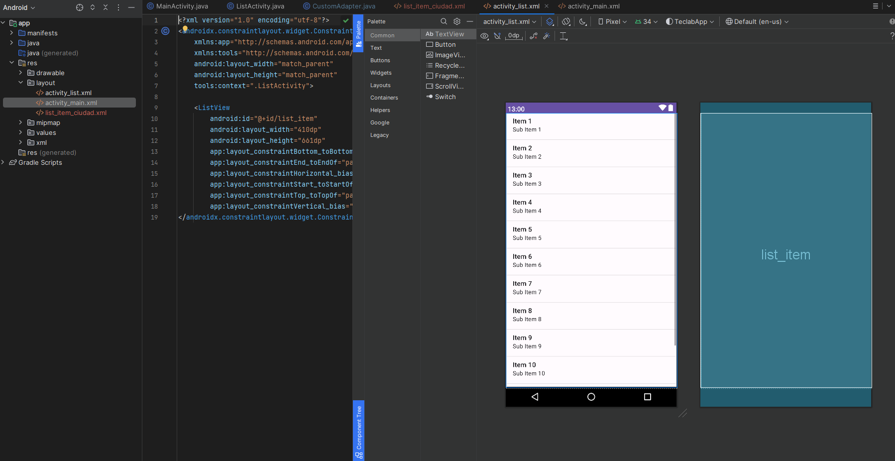
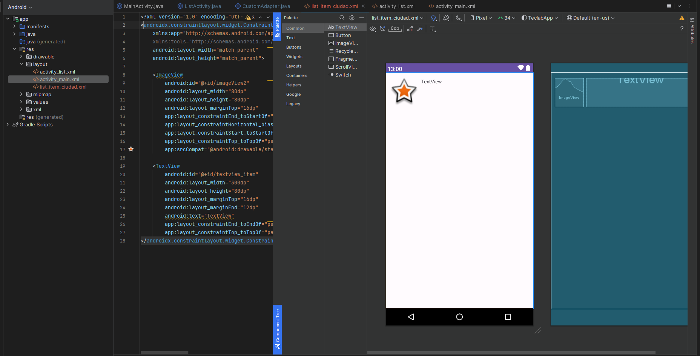

# App de clima nativa para Android

## Desarrollada en Java con ide Android Studio
https://api.openweathermap.org/data/2.5/weather?lat=-38.7196&lon=-62.2724&appid=ff9a0c998f50abbc31fe4b4aa7492dcf&units=metric&lang=es

### API 3

### API 2

    
    

